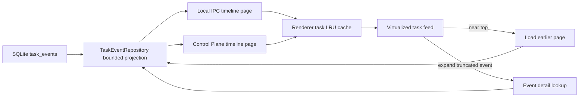

# Long-Session Timeline Performance

This document defines how Idexal CoWork loads, renders, resumes, and remotely transports very large task histories without materializing an entire session in the renderer or repeatedly replaying the full event table.

It covers the desktop renderer, Electron database repository, Control Plane transport, task-resume path, compatibility behavior, memory limits, and the required performance checks.

## Goals

- Open old or tool-heavy tasks using a bounded initial read.
- Keep scrolling smooth by rendering only the visible feed window.
- Load earlier history incrementally as the user approaches the top of the feed.
- Keep task switching fast with a small byte-bounded LRU cache.
- Fetch an oversized event payload only when the user expands that event, and release it when collapsed.
- Keep local and remote task behavior aligned without allowing one device's asynchronous response to update another device's view.
- Resume interrupted tasks from bounded checkpoint, snapshot, plan, and state queries.
- Fail performance validation when fixture size or heap evidence is missing.

## End-to-End Flow



The initial task view never needs the complete event history. The repository returns a recent page with a cursor for older events. The renderer merges pages by event identity, preserves ordering, and caps retained state. The virtual list reports its visible range so the UI can request another page before the user reaches the first loaded row.

## Shared Limits

The canonical values live in `src/shared/task-timeline-limits.ts`.

| Limit | Value | Purpose |
|---|---:|---|
| Initial event count | 64 | Maximum rows requested for the first task view |
| Initial payload budget | 256 KiB | Maximum serialized payload retained for the first page |
| History page count | 160 | Maximum rows requested when loading earlier history |
| History payload budget | 512 KiB | Maximum serialized payload retained for one history page |
| Default single-event payload | 64 KiB | Payload threshold before returning a preview |
| Maximum page count | 600 | Server-side hard ceiling |
| Maximum page payload | 2 MiB | Server-side hard ceiling |
| Maximum single-event payload | 256 KiB | Server-side hard ceiling for page projection |
| Truncated preview | 4,096 characters | Inline preview stored in the projected event payload |
| Cached tasks | 5 | Renderer LRU entry limit |
| Timeline cache payload | 4 MiB | Combined renderer timeline-cache budget |
| Expanded detail cache | 4 MiB | Maximum payload size eligible for detail caching |

The selected task's merged timeline is also capped in `src/renderer/App.tsx` by event count and retained payload bytes. These are separate from the cross-task LRU limits.

## Database Paging Contract

`TaskEventRepository.findTimelinePage()` uses an explicit column projection rather than `SELECT *`. SQLite computes payload size before mapping rows and replaces an oversized payload with a short preview. The result includes:

- `events`: chronological events for the requested page;
- `hasMoreHistory`: whether an older row remains;
- `nextCursor`: the oldest returned row's composite cursor;
- `summary.eventCount`;
- `summary.payloadBytes`;
- `summary.truncatedEventCount`;
- `summary.largestEventPayloadBytes`.

The cursor is the tuple `(COALESCE(seq, timestamp), timestamp, id)`. All three fields are required for deterministic traversal when multiple events share a timestamp or sequence. Older-page and forward-resume predicates use the same ordering contract in opposite directions.

`findEventDetail()` is the only route that returns the complete stored payload for one event. Page reads must not silently increase their single-event limit to simulate detail loading.

## Renderer Loading and Memory Lifecycle

`src/renderer/App.tsx` owns task selection, initial hydration, history merging, caching, and local/remote request guards.

### Initial and older history

1. On selection, use the LRU entry immediately when present.
2. Request the bounded initial page from Electron.
3. Merge live events received while the page request was in flight.
4. Save the page cursor and `hasMoreHistory` state.
5. When the virtual feed approaches its first loaded row, request a history page.
6. Merge by `eventId` or row `id`, preserve chronological order, and reapply renderer memory caps.

`src/renderer/hooks/useVirtualList.ts` exposes the visible start and end indexes used by `MainContent` for automatic near-top loading. Fetches are guarded so only one history request is active at a time.

### Task cache

`src/renderer/utils/task-timeline-cache.ts` implements an LRU cache. Reading an entry refreshes recency. Insertion evicts the oldest entries until both the five-task and 4 MiB limits are satisfied. Cache entries retain the events, cursor, `hasMoreHistory`, newest sequence, payload estimate, and cache timestamp.

### Expanded event detail

Page events with `__coworkPayloadTruncated: true` expose an event detail ID. Expanding such an event requests its complete payload. The renderer:

- scopes cache and in-flight keys by device, task, and event;
- keeps the original preview for restoration;
- keeps at most one expanded full-detail event resident;
- caches that detail only when its payload is no larger than 4 MiB;
- restores the preview and releases the cache entry on collapse;
- discards a late response when the selected task or remote device changed;
- negative-caches missing detail responses briefly to avoid retry storms.

The helper functions are in `src/renderer/utils/task-event-detail-cache.ts`; the expand/collapse lifecycle is split between `App.tsx` and `src/renderer/components/MainContent/MainContent.tsx`.

## Remote and Mixed-Version Behavior

The Control Plane exposes two admin-scoped methods:

- `task.timelinePage` for bounded pages;
- `task.eventDetail` for one complete event.

`src/electron/control-plane/task-event-transport.ts` validates input, verifies the requested task scope, calls the repository, and sanitizes payloads before transport. The same handlers are registered for local-device dispatch and the remote Control Plane server.

Remote async responses are accepted only when both the device ID and task ID still match the active view. Opening a newer remote request invalidates any older open request.

For a device that does not yet support `task.timelinePage`, the renderer falls back to `task.events` with a limit of 600 rather than showing only the first small page. The legacy response has no continuation cursor. When it reaches the 600-event ceiling, the UI warns that earlier history requires updating the remote device; it must not claim the full history is available.

## Checkpoint and Resume Bounds

Checkpoint capture and interrupted-task resume live in `src/electron/agent/daemon.ts`.

### Checkpoint capture

Most task events return before any checkpoint query. Only a conversation snapshot, meaningful user/assistant exchange, or task completion can trigger checkpoint work; completion writes a checkpoint only when substantive outcome evidence exists.

Evidence windows are built from a bounded recent-message query. Periodic exchange counts advance from the last checkpoint and a maximum 12-event forward tail instead of scanning the complete task history on each message. The latest conversation snapshot is fetched with a single-row query.

### Resume reconstruction

Resume uses these bounded components:

- latest `plan_created` or `plan_updated` definition: 1 event;
- latest plan step state: at most 400 events;
- conversation/runtime state tail: at most 200 events;
- latest conversation snapshot: 1 event when no checkpoint exists.

When a checkpoint references a source event, the repository resolves that event's composite cursor without loading its payload. If only a timestamp is available, the fallback cursor uses an empty ID so same-timestamp events remain eligible. A legacy task with neither checkpoint nor snapshot uses the bounded recent state path and is logged as `legacy_bounded`; it never falls back to full-history replay for startup recovery.

Plan restoration accepts both created and updated plan definitions and preserves completed, failed, and skipped step states.

## Performance Profiler

`scripts/qa/profile_electron_task_switch.mjs` is the desktop evidence harness.

The profiler:

- creates an isolated temporary user-data directory by default;
- seeds deterministic task and event fixtures;
- verifies the requested task count, primary event count, and at least 75% of the requested payload bytes, including when a reusable fixture directory is supplied;
- launches Electron with `--enable-precise-memory-info`;
- brings the renderer page to the foreground before measuring;
- records startup marks, task-switch marks, timeline IPC size, heap growth, frame gaps, long tasks, document nodes, and virtual feed nodes;
- fails a configured heap budget when heap measurement is unavailable instead of skipping the check;
- removes temporary fixture profiles unless explicitly retained.

The deterministic large-session command is:

```bash
npm run qa:perf:large-session
```

It seeds 15,529 events, 741 turns, and a requested 231 MiB payload, injects periodic heavy events, performs 20 production-mode task switches, and enforces the production budget profile.

The validation run on 2026-08-17 completed 20/20 switches with:

- task-header p95: 2.5 ms;
- timeline-data p95: 5.0 ms;
- renderer heap growth: 3,769,082 bytes;
- recorded frame gaps: 0;
- recorded long tasks: 0.

These figures are evidence from one local run, not universal product guarantees. Compare future runs against the configured budgets and preserve the generated JSON report when investigating a regression.

## Required Validation

Run the focused fixture and repository coverage:

```bash
npm run qa:perf:fixtures
npx vitest run \
  src/electron/control-plane/__tests__/task-event-transport.test.ts \
  src/electron/database/__tests__/task-event-repository-timeline-page.test.ts \
  src/electron/database/__tests__/task-event-repository-replay.test.ts \
  src/renderer/utils/__tests__/task-timeline-cache.test.ts \
  src/renderer/utils/__tests__/task-event-detail-cache.test.ts \
  tests/profile-electron-task-switch.test.ts
```

Run compile and desktop gates:

```bash
npm run type-check
npm run build:electron
npm run build:daemon
npm run build:react
npm run lint
npm run qa:perf:large-session
```

`npm run lint` currently reports repository-wide warnings while exiting successfully. New code should not introduce additional warnings in the touched files.

## File Map

| File | Responsibility |
|---|---|
| `src/shared/task-timeline-limits.ts` | Shared page, payload, cache, and detail limits |
| `src/shared/types.ts` | Cursor, page, summary, and detail contracts |
| `src/electron/database/repositories.ts` | Bounded SQL projection, paging, detail, cursor, snapshot, and replay-tail queries |
| `src/electron/control-plane/protocol.ts` | Remote method names |
| `src/electron/control-plane/task-event-transport.ts` | Parameter validation, task scoping, and transport sanitization |
| `src/electron/control-plane/handlers.ts` | Local and remote method registration |
| `src/daemon/control-plane-methods.ts` | Node daemon method exposure |
| `src/electron/agent/daemon.ts` | Bounded checkpoint capture and interrupted-task resume |
| `src/renderer/App.tsx` | Initial load, page merge, LRU integration, detail lifecycle, and remote compatibility |
| `src/renderer/components/MainContent/MainContent.tsx` | Near-top loading and detail expand/collapse actions |
| `src/renderer/hooks/useVirtualList.ts` | Visible-range reporting |
| `src/renderer/utils/task-timeline-cache.ts` | Byte- and count-bounded LRU cache |
| `src/renderer/utils/task-event-detail-cache.ts` | Device-scoped detail keys and payload estimation |
| `scripts/qa/profile_electron_task_switch.mjs` | Isolated desktop performance harness |
| `package.json` | Performance fixture and large-session commands |

## Regression Rules

- Do not replace timeline page queries with unbounded `findByTaskId()` calls.
- Do not remove `id` from the cursor tie-breaker.
- Do not retain multiple expanded full event payloads in renderer state.
- Do not key remote caches or in-flight requests by task ID alone.
- Do not silently treat the legacy 600-event fallback as complete history.
- Do not skip heap budgets when `performance.memory` is absent.
- Do not reuse a fixture profile without verifying its event and payload size.
- Do not claim large-session readiness from unit tests alone; run the desktop profile.
